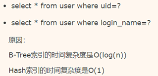

<!-- more -->

数据库设计需要注意什么？

## 一、 基础规范

### 1、必须使用InnoDB存储引擎

>支持事务、行级锁、并发性能更好、CPU及内存缓存页优化使得资源利用率更高

### 2、新库默认使用utf8mb4字符集

>utf8mb4是utf8的超集，emoji表情以及部分不常见汉字在utf8下会表现为乱码。

### 3、数据表、数据字段必须加中文注释

> 添加注释能以后更好的知道是干什么用的

### 4、禁止使用存储过程、视图、触发器、Event

> 高并发大数据的互联网业务，架构设计思想是“解放数据库CPU，将计算转移到服务层”，并发量大的情况下，这些功能会将数据库拖死，业务逻辑放在服务层具备更好的拓展性，能够轻易实现“增机器就加性能”。数据库擅长存储与索引

### 5、禁止存储大文件或者大照片

> 大文件和照片存储在文件系统，数据库里存URI更好

### 6、禁止使用应用程序配置文件内的账号手工访问线上数据库

### 7、禁止非DBA对线上数据库进行写操作，修改线上数据需要提交工单，由DBA执行，提交的SQL语句必须经过测试

### 8、分配非DBA以只读账号，必须通过VPN+跳板机访问授权的从库

### 9、开发、测试、线上环境隔离

### 10、不在数据库做计算，cpu计算务必移至业务层

### 11、平衡范式与冗余，为提高效率可以牺牲范式设计，冗余数据

### 12、拒绝3B，大SQL，大事务，大批量

## 二、 命名规范

### 1、只允许使用内网域名，而不是ip连接数据库

> 使用域名，在切换数据库服务器的时候，只需要更改DNS域名解析，不需要更改配置文件。不只是数据库，缓的连接，服务的连接都必须使用内网域名。

线上环境、开发环境、测试环境数据库内网域名命名规范

> 业务名称：xxx
>
> 线上环境：dj.xxx.db
>
> 开发环境：dj.xxx.rdb
>
> 测试环境：dj.xxx.tdb

### 2、库名、表名、字段名：小写，下划线风格，不超过32个字符，禁止拼音英文混用

### 3、表名t_xxx，非唯一索引名idx_xxx，唯一索引名uniq_xxx（idx：索引文件Index file）

 

## 三、 表设计规范

### 1、单实例表数目必须小于500

### 2、单表列数目必须小于30

### 3、表必须有主键，例如自增主键

### 4、禁止使用外键，如果有外键完整性约束，需要应用程序控制外键会导致表与表之间的耦合，update和delete操作都会涉及相关联的表，影响SQL的性能，甚至会造成死锁。高并发情况下容易造成数据库性能，大数据高并发业务场景数据库使用性能优先。

### 5、控制单表数据量，单表记录控制在千万级。

## 四、 字段设计必须规范

### 1、必须把字段定义为NOT NULL并且提供默认值

> a)     null的列使索引/索引统计/值都比较复杂，对MySQL来说更难优化
>
> b)    null这种类型MySQL内部需要进行特殊处理，增加数据库处理记录的复杂性

### 2、禁止使用TEXT、BLOB类型

> 会浪费更多的磁盘和空间内存，非必要的大量的大字段查询会淘汰掉热数据，导致内存命中率急剧降低，影响数据库的性能。

### 3、禁止使用小数存储货币

> 使用整数，小数容易导致钱对不上

### 4、必须使用varchar（20）存储手机号

> a)     涉及到区号或者国家的代号
>
> b)    手机号会去做数学运算么？
>
> c)     varchar可以支持模糊查询 例如：like”138%”

### 5、禁止使用ENUM，可使用TINYINT代替

> a)     增加新的ENUM值要做DDL操作
>
> b)    ENUM的内部实际存储就是整数，你以为自己定义的是字符串？

### 6、字段选择类型更小的通常更好：小的数据类型更快，因为它们占用更少的磁盘、内存和CPU缓存，并且处理需要的CPU周期更少。

## 五、 索引设计规范

### 1、单表索引建议控制在5个内

### 2、单索引字段数不允许草超过5个

> 字段超过5个，实际起不到有效过滤数据的作用

### 3、禁止在更新十分频繁、区分度不高的属性上建立索引

> 更新会变更B+树，更新频繁的字段建立索引会大大降低数据库性能
>
> “性别”这种区分度不大的属性，建立索引是没有什么意义的，不能有效过滤数据，性能与全表扫描类似

### 4、建立组合索引，必须把区分度高的字段放在前面

### MyISAM和INNODB的区别

1. 事务安全（MyISAM不支持事务，INNODB支持事务）

2. 外键MyISAM不支持外键，INNODB支持外键

3. 锁机制（MyISAM是表锁，INNODB是行锁）

4. 查询和添加速度（MyISAM批量插入速度快）

5. 支持全文索引（MyISAM支持全文索引，INNODB不支持全文索引）

6. MyISAM内存空间使用率比INNODB低

##  六、SQL语句优化

### 1、禁止使用select *，只获取必要的字段，需要显示说明列属性

> a)     读取不需要的列会增加CPU、IO、NET消耗
>
> b)    不能有效的利用覆盖索引
>
> c)     使用select *容易在增加或者删除字段后出现程序BUG

### 2、禁止使用insert into t_xxx values(xxx)，必须显示执行插入的列属性

> a)     容易在增加或者删除字段后出现程序BUG

### 3、禁止使用属性隐式转换

> a)     Select uid from t_user where phone=13885236846 会导致全表扫描，而不能命中phone索引

### 4、禁止在where条件的属性上使用函数或者表达式，在属性上进行计算不能命中索引

> a)     Select uid from t_user where from_unixtime(day)>=’2017-02-15’会导致全表扫描
>
> b)    正确为：select uid from t_user where day>=unix_timestamp(‘2017-02-15 00:00:00’)

### 5、禁止负向查询，以及%开头的模糊查询

> a)     负向查询条件：NOT、!=、<>、!<、!>、NOT IN、NOT LIKE等，会导致全表扫描
>
> b)    %开头的模糊查询，会导致全表扫描

### 6、禁止大表使用JOIN查询，禁止大表使用子查询

> a)     会产生临时表，消耗较多的内存与CPU，极大影响数据库性能

### 7、禁止使用OR条件，必须改为IN查询

> a)     旧版本的MySQL的OR查询是不能命中索引的，即使能命中索引，为何要让数据库耗费更多的CPU帮助实施查询优化？

### 8、应用程序必须捕获SQL异常，并有相应的处理

### 9、负向条件查询不能使用索引

> a)     Select * from order where status!=0 and status!=1
>
> not in/not exists都不是很好的习惯
>
> 可以优化为
>
> Select * from order where status in(2,3)

### 10、前导模糊查询不能用索引

> a)     Select * from order where desc like ‘%xxx’

而非前导模糊查询则可以：

> Select * from order where desc like ‘xxx%’

### 11、数据区分度不大的字段不宜使用索引

> a)     能过滤80%数据时就可以使用索引

### 12、limit高效分页

> a)    limit越大，效率越低
>
> select id from t limit 1000,10 应改为: select id from t where id>1000 limit 10

### 13、如果业务大部分是单条查询，使用Hash索引性能更好

### 14、允许为null的列，查询有潜在大坑

> a)     单列索引不存null值，复合索引不存全为null的值，如果列允许为null，可能会得到“不符合预期”的结果集。

 