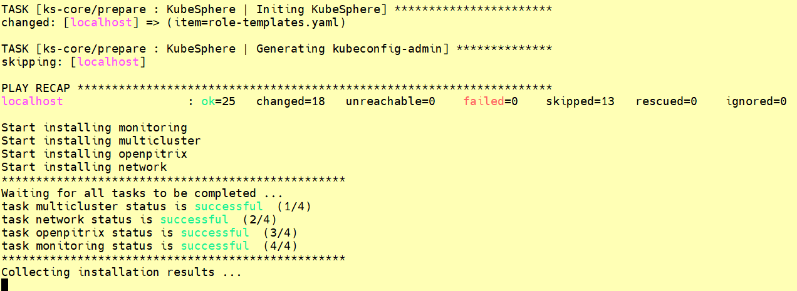
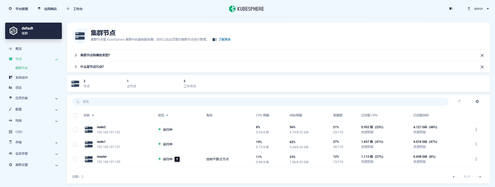
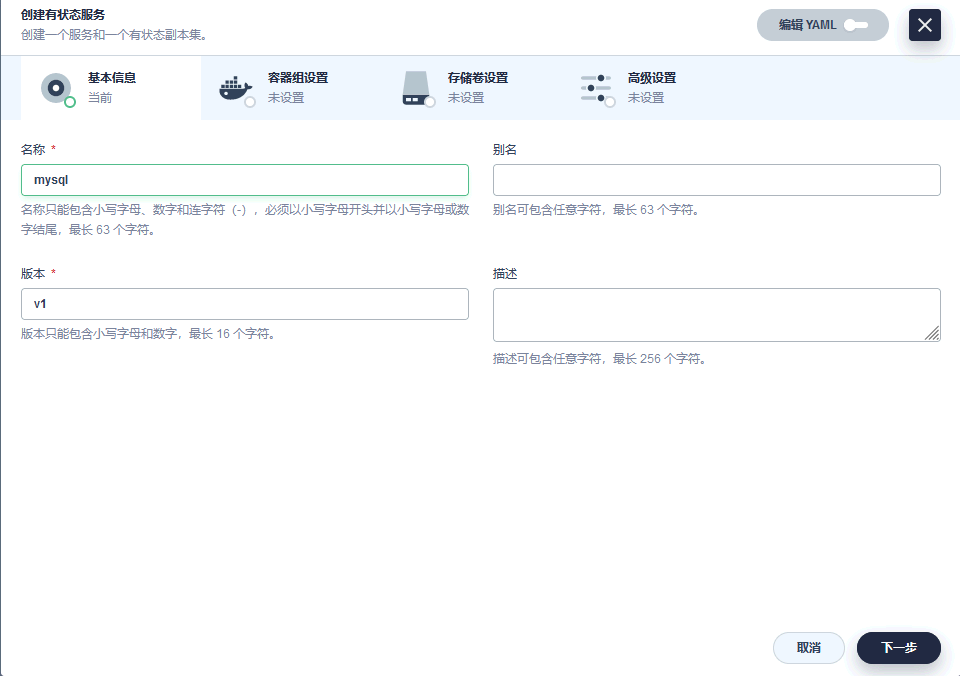
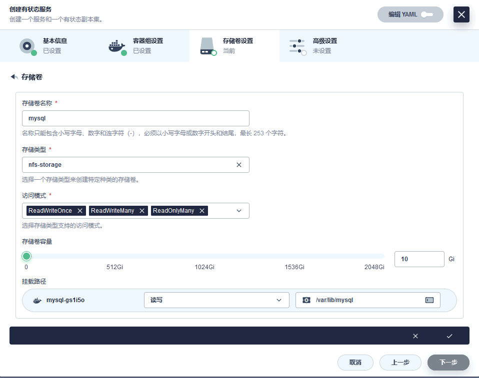
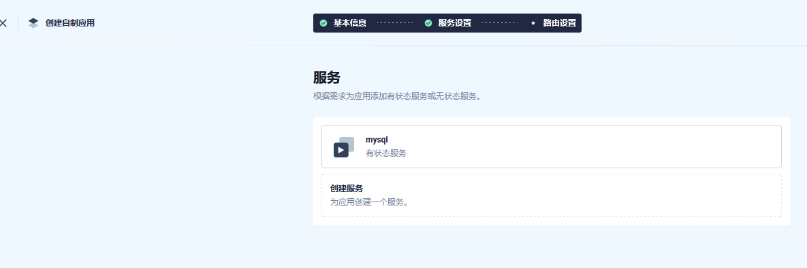
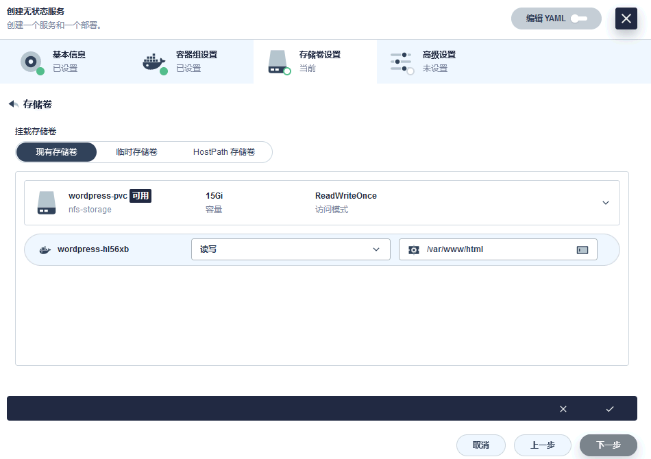
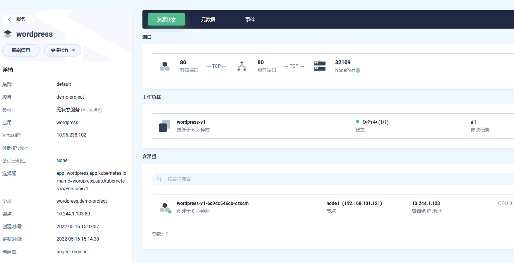

<!-- more -->

# k8s-可视化管理工具-KubeSphere

在`master`主机安装KubeSphere

[官网](https://kubesphere.com.cn/zh/)

[ks-installer 教程](https://github.com/kubesphere/ks-installer/blob/master/README_zh.md)

[https://github.com/kubesphere/kubesphere](https://github.com/kubesphere/kubesphere) **star:10.8K**

[gitee.com/k8s_s/kubesphere](https://gitee.com/k8s_s/kubesphere)

## KubeSphere 版本选择

[版本说明](https://v3-2.docs.kubesphere.io/zh/docs/release/release-v321/)

| KubeSphere |               支持的 Kubernetes 版本               |
|:----------:|:---------------------------------------------:|
|   3.3.x    | 1.19.x, 1.20.x, 1.21.x, 1.22.x (experimental) |
|   3.2.x    | 1.19.x, 1.20.x, 1.21.x, 1.22.x (experimental) |
|   3.1.x    |        1.17.x, 1.18.x, 1.19.x, 1.20.x         |
|   3.0.x    |        1.15.x, 1.16.x, 1.17.x, 1.18.x         |

## 环境准备

在安装之前，需要配置 Kubernetes 集群中的**默认**存储类型。

- 1、NFS

- 2、PV&PVC

- 3、ConfigMap [ConfigMap](https://kubernetes.io/zh-cn/docs/concepts/configuration/configmap/)

- 4、secret  [secret](https://kubernetes.io/zh-cn/docs/concepts/configuration/secret/)

[具体设置请看](./nfs-pv-pvc-config-secret.html)

## 需要的镜像

> kubesphere/pause:3.4.1
>
> kubesphere/kube-apiserver:v1.22.9
>
> kubesphere/kube-proxy:v1.22.9
>
> kubesphere/kube-controller-manager:v1.22.9
>
> kubesphere/kube-proxy:v1.22.9
>
> kubesphere/kube-scheduler:v1.22.9
>
> kubesphere/k8s-dns-node-cache:1.15.12
>
> kubesphere/k8s-dns-node-cache:1.15.12
>
> coredns/coredns:v1.8.4
>
> calico/kube-controllers:v3.20.0
>
> calico/cni:v3.20.0
>
> calico/kube-controllers:v3.20.0
>
> calico/node:v3.20.0
>
> calico/cni:v3.20.0
>
> calico/pod2daemon-flexvol:v3.20.0

dkpush registry.cn-chengdu.aliyuncs.com/jinfang/ks-apiserver:v3.2.1

dkpush registry.cn-chengdu.aliyuncs.com/jinfang/ks-console:v3.2.1

dkpush registry.cn-chengdu.aliyuncs.com/jinfang/fluent-bit:v1.8.3

dkpush registry.cn-chengdu.aliyuncs.com/jinfang/kube-rbac-proxy:v0.8.0

dkpush registry.cn-chengdu.aliyuncs.com/jinfang/openldap:1.3.0

dkpush registry.cn-chengdu.aliyuncs.com/jinfang/node-exporter:v0.18.1

## 1、环境安装

`A B C`选其一即可

### A、参考helm笔记

### B、安装存储类 OpenEBS （仅适用于开发测试环境）<a name="OpenEBS"></a>

<https://v2-1.docs.kubesphere.io/docs/zh-CN/appendix/install-openebs/>

默认情况下，KubeKey 将安装 [OpenEBS](https://openebs.io/) 来为开发和测试环境配置 LocalPV

```text
helm search repo stable | grep openebs
helm install --namespace openebs -n --generate-name openebs stable/openebs --version 1.11.1
kubectl apply -f https://github.com/openebs/charts/blob/openebs-3.0.6/archive/1.9.x/openebs-operator-1.9.0.yaml
https://github.com/openebs/charts/blob/openebs-3.0.6/charts/openebs/Chart.yaml
```

### C、KubeKey-2.2.2（推荐）<a name="KubeKey"></a>

|    选项     | Kubernetes 版本 ≥ 1.18 | Kubernetes 版本 < 1.18 |
|:---------:|----------------------|----------------------|
|   socat   | 必须安装                 | 可选，但推荐安装             |
| conntrack | 必须安装                 | 可选，但推荐安装             |
| ebtables  | 可选，但推荐安装             | 可选，但推荐安装             |
|   ipset   | 可选，但推荐安装             | 可选，但推荐安装             |
|  ipvsadm  | 可选，但推荐安装             | 可选，但推荐安装             |

> yum install -y socat conntrack ebtables ipset ipvsadm

默认情况下，KubeKey 将安装 [OpenEBS](#OpenEBS) 来为开发和测试环境配置 LocalPV

<https://kubesphere.io/zh/>

下载：<https://github.com/kubesphere/kubekey/releases、https://gitee.com/k8s_s/kubekey/tags>

<https://github.com/kubesphere/kubekey/releases/download/v2.2.2/kubekey-v2.2.2-linux-amd64.tar.gz>

或使用以下命令：

```shell
export KKZONE=cn

curl -sfL https://get-kk.kubesphere.io | VERSION=v1.2.0 sh -
curl -sfL https://get-kk.kubesphere.io | VERSION=v2.2.2 sh -
或
cd && wget https://github.com/kubesphere/kubekey/releases/download/v2.2.2/kubekey-v2.2.2-linux-amd64.tar.gz
```

安装 kk

```shell
chmod -R 777 kubekey-v2.2.2-linux-amd64.tar.gz && \
mkdir ./kubekey-v2.2.2 && \
tar -zxvf kubekey-v2.2.2-linux-amd64.tar.gz -C ./kubekey-v2.2.2 \
&& rm -rf ./kubekey-v2.2.2/README.md && \
  chmod +x ./kubekey-v2.2.2/kk && \
  cp ./kubekey-v2.2.2/kk /usr/local/bin/ && \
cp ./kubekey-v2.2.2/kk ./ && \
rm -rf ./kubekey-v2.2.2 && \
ls /usr/local/bin/ && kk version
```

## 2、使用 KubeKey 手动安装（推荐1）<a name="使用 KubeKey 安装"></a>

**查看支持的k8s版本**：`kk version --show-supported-k8s`

2.0.0：<https://gitee.com/k8s_s/kubekey/blob/v2.0.0/docs/kubernetes-versions.md>

```
v1.19.0 v1.19.8 v1.19.9
v1.20.4 v1.20.6 v1.20.10
v1.21.4 v1.21.5
v1.22.1
v1.23.0
```

2.1.0：<https://gitee.com/k8s_s/kubekey/blob/v2.1.0/docs/kubernetes-versions.md>

```
v1.19.0 v1.19.8 v1.19.9
v1.20.4 v1.20.6 v1.20.10
v1.21.4 v1.21.5
v1.22.1 v1.22.9
v1.23.0 v1.23.6
v1.24.0
```

2.2.2：<https://gitee.com/k8s_s/kubekey/blob/v2.2.2/docs/kubernetes-versions.md>

```
v1.19.0 v1.19.8 v1.19.9
v1.20.4 v1.20.6 v1.20.10
v1.21.0->13
v1.22.0->10
v1.23.0->8
v1.24.0 v1.24.1
```

内置下载版本：【kubeadm v1.22.9、kubelet v1.22.9、kubectl v1.22.9、helm v3.9.4、kubecni v0.9.1、crictl v1.22.0、etcd v3.4.13、docker 20.10.8】

**开始 init config 文件**

> ./kk create config --with-kubernetes v1.22.9 --with-kubesphere v3.2.1

kk create config 会自动创建 `config-sample.yaml`

或者复制这个文件并根据情况修改：<https://gitee.com/k8s_s/kubekey/blob/v2.2.2/docs/config-example.md>

**主要修改内容：**

```json
  - {name: master, address: 192.168.100.130, internalAddress: 192.168.100.130, user: root, password: "123456a"}
  - {name: node1, address: 192.168.100.131, internalAddress: 192.168.100.131, user: root, password: "123456a"}
  - {name: node2, address: 192.168.100.132, internalAddress: 192.168.100.132, user: root, password: "123456a"}

  - {name: master, address: 192.168.100.130, internalAddress: 192.168.100.130, privateKeyPath: "~/.ssh/id_rsa"}
  - {name: node1, address: 192.168.100.131, internalAddress: 192.168.100.131, privateKeyPath: "~/.ssh/id_rsa"}
  - {name: node2, address: 192.168.100.132, internalAddress: 192.168.100.132, privateKeyPath: "~/.ssh/id_rsa"}
```

```yaml

apiVersion: kubekey.kubesphere.io/v1alpha2
kind: Cluster
metadata:
  name: sample
spec:
  hosts:
  - {name: master, address: 192.168.100.130, internalAddress: 192.168.100.130, user: root, password: "123456a"}
  - {name: node1, address: 192.168.100.131, internalAddress: 192.168.100.131, user: root, password: "123456a"}
  - {name: node2, address: 192.168.100.132, internalAddress: 192.168.100.132, user: root, password: "123456a"}

  roleGroups:
    etcd:
    - master
    control-plane: 
    - master
    worker:
    - node1
    - node2
  controlPlaneEndpoint:
    ## Internal loadbalancer for apiservers 
    ##开启内置高可用模式
    # internalLoadbalancer: haproxy
    
clusterRole: host # host | member | none
# "registry.cn-chengdu.aliyuncs.com/jinfang"
# "registry.cn-beijing.aliyuncs.com/kubesphereio" 
privateRegistry: "registry.cn-chengdu.aliyuncs.com/jinfang"
network.plugin: flannel
```

**初始化yaml**

```shell
./kk init os -f config-sample.yaml
```

[master-kubeadm-初始化](./basis.html#master-kubeadm-初始化)  查看 master-kubeadm-初始化

**开始安装：使用配置文件创建集群**

<https://kubesphere.com.cn/docs/multicluster-management/enable-multicluster/direct-connection/>

每个主机都创建软连接`/usr/bin/kubelet` 到 `/usr/local/bin/`

ln -s /usr/bin/kube* /usr/local/bin/

**解决没有这个文件：/etc/kubernetes/kubeadm-config.yaml**

master主机执行：kubectl -n kube-system get cm kubeadm-config -o yaml >> /etc/kubernetes/kubeadm-config.yaml

```bash
export KKZONE=cn

./kk create cluster -f config-sample.yaml

./kk delete cluster -f config-sample.yaml
```

会自动创建：/root/kubekey/

```
#####################################################
###              Welcome to KubeSphere!           ###
#####################################################

Console: http://192.168.100.130:30880
Account: admin
Password: P@88w0rd
NOTES：
  1. After you log into the console, please check the
     monitoring status of service components in
     "Cluster Management". If any service is not
     ready, please wait patiently until all components 
     are up and running.
  2. Please change the default password after login.

#####################################################
https://kubesphere.io             20xx-xx-xx xx:xx:xx
#####################################################
```

登录：<http://nginx.k8s.com:30880/> 

<http://ks.k8s.com:30880/>

## 3、 以 ks-installer-3.2.1 安装 kubesphere3.2.1（推荐2）

[github.com/kubesphere/ks-installer/](https://github.com/kubesphere/ks-installer/)

[gitee.com/k8s_s/ks-installer](https://gitee.com/k8s_s/ks-installer)

### 下载文件

```
wget https://github.com/kubesphere/ks-installer/releases/download/v3.2.1/kubesphere-installer.yaml && wget https://github.com/kubesphere/ks-installer/releases/download/v3.2.1/cluster-configuration.yaml
```

```
https://gitee.com/k8s_s/ks-installer/blob/v3.2.1/deploy/kubesphere-installer.yaml
https://gitee.com/k8s_s/ks-installer/blob/v3.2.1/deploy/cluster-configuration.yaml
```

### 安装

kubectl apply -f ks-installer.yaml

kubectl apply -f ks-cluster.yaml

*等待10秒左右，再查看安装进度:*

> kubectl logs -n kubesphere-system $(kubectl get pod -n kubesphere-system -l app=ks-install -o jsonpath='{.items[0].metadata.name}') -f



```
#####################################################
###              Welcome to KubeSphere!           ###
#####################################################

Console: http://192.168.100.130:30880
Account: admin
Password: P@88w0rd
NOTES：
  1. After you log into the console, please check the
     monitoring status of service components in
     "Cluster Management". If any service is not
     ready, please wait patiently until all components 
     are up and running.
  2. Please change the default password after login.

#####################################################
https://kubesphere.io             20xx-xx-xx xx:xx:xx
#####################################################
```

kubectl get svc/ks-console -n kubesphere-system

解决etcd监控证书找不到问题:

> kubectl -n kubesphere-monitoring-system create secret generic kube-etcd-client-certs  --from-file=etcd-client-ca.crt=/etc/kubernetes/pki/etcd/ca.crt  --from-file=etcd-client.crt=/etc/kubernetes/pki/apiserver-etcd-client.crt  --from-file=etcd-client.key=/etc/kubernetes/pki/apiserver-etcd-client.key

### ks-installer.yaml

::: details 点击查看代码

```yaml
---
apiVersion: apiextensions.k8s.io/v1
kind: CustomResourceDefinition
metadata:
  name: clusterconfigurations.installer.kubesphere.io
spec:
  group: installer.kubesphere.io
  versions:
    - name: v1alpha1
      served: true
      storage: true
      schema:
        openAPIV3Schema:
          type: object
          properties:
            spec:
              type: object
              x-kubernetes-preserve-unknown-fields: true
            status:
              type: object
              x-kubernetes-preserve-unknown-fields: true
  scope: Namespaced
  names:
    plural: clusterconfigurations
    singular: clusterconfiguration
    kind: ClusterConfiguration
    shortNames:
      - cc

---
apiVersion: v1
kind: Namespace
metadata:
  name: kubesphere-system

---
apiVersion: v1
kind: ServiceAccount
metadata:
  name: ks-installer
  namespace: kubesphere-system

---
apiVersion: rbac.authorization.k8s.io/v1
kind: ClusterRole
metadata:
  name: ks-installer
rules:
- apiGroups:
  - ""
  resources:
  - '*'
  verbs:
  - '*'
- apiGroups:
  - apps
  resources:
  - '*'
  verbs:
  - '*'
- apiGroups:
  - extensions
  resources:
  - '*'
  verbs:
  - '*'
- apiGroups:
  - batch
  resources:
  - '*'
  verbs:
  - '*'
- apiGroups:
  - rbac.authorization.k8s.io
  resources:
  - '*'
  verbs:
  - '*'
- apiGroups:
  - apiregistration.k8s.io
  resources:
  - '*'
  verbs:
  - '*'
- apiGroups:
  - apiextensions.k8s.io
  resources:
  - '*'
  verbs:
  - '*'
- apiGroups:
  - tenant.kubesphere.io
  resources:
  - '*'
  verbs:
  - '*'
- apiGroups:
  - certificates.k8s.io
  resources:
  - '*'
  verbs:
  - '*'
- apiGroups:
  - devops.kubesphere.io
  resources:
  - '*'
  verbs:
  - '*'
- apiGroups:
  - monitoring.coreos.com
  resources:
  - '*'
  verbs:
  - '*'
- apiGroups:
  - logging.kubesphere.io
  resources:
  - '*'
  verbs:
  - '*'
- apiGroups:
  - jaegertracing.io
  resources:
  - '*'
  verbs:
  - '*'
- apiGroups:
  - storage.k8s.io
  resources:
  - '*'
  verbs:
  - '*'
- apiGroups:
  - admissionregistration.k8s.io
  resources:
  - '*'
  verbs:
  - '*'
- apiGroups:
  - policy
  resources:
  - '*'
  verbs:
  - '*'
- apiGroups:
  - autoscaling
  resources:
  - '*'
  verbs:
  - '*'
- apiGroups:
  - networking.istio.io
  resources:
  - '*'
  verbs:
  - '*'
- apiGroups:
  - config.istio.io
  resources:
  - '*'
  verbs:
  - '*'
- apiGroups:
  - iam.kubesphere.io
  resources:
  - '*'
  verbs:
  - '*'
- apiGroups:
  - notification.kubesphere.io
  resources:
  - '*'
  verbs:
  - '*'
- apiGroups:
  - auditing.kubesphere.io
  resources:
  - '*'
  verbs:
  - '*'
- apiGroups:
  - events.kubesphere.io
  resources:
  - '*'
  verbs:
  - '*'
- apiGroups:
  - core.kubefed.io
  resources:
  - '*'
  verbs:
  - '*'
- apiGroups:
  - installer.kubesphere.io
  resources:
  - '*'
  verbs:
  - '*'
- apiGroups:
  - storage.kubesphere.io
  resources:
  - '*'
  verbs:
  - '*'
- apiGroups:
  - security.istio.io
  resources:
  - '*'
  verbs:
  - '*'
- apiGroups:
  - monitoring.kiali.io
  resources:
  - '*'
  verbs:
  - '*'
- apiGroups:
  - kiali.io
  resources:
  - '*'
  verbs:
  - '*'
- apiGroups:
  - networking.k8s.io
  resources:
  - '*'
  verbs:
  - '*'
- apiGroups:
  - kubeedge.kubesphere.io
  resources:
  - '*'
  verbs:
  - '*'
- apiGroups:
  - types.kubefed.io
  resources:
  - '*'
  verbs:
  - '*'
- apiGroups:
  - monitoring.kubesphere.io
  resources:
  - '*'
  verbs:
  - '*'
- apiGroups:
  - application.kubesphere.io
  resources:
  - '*'
  verbs:
  - '*'


---
kind: ClusterRoleBinding
apiVersion: rbac.authorization.k8s.io/v1
metadata:
  name: ks-installer
subjects:
- kind: ServiceAccount
  name: ks-installer
  namespace: kubesphere-system
roleRef:
  kind: ClusterRole
  name: ks-installer
  apiGroup: rbac.authorization.k8s.io

---
apiVersion: apps/v1
kind: Deployment
metadata:
  name: ks-installer
  namespace: kubesphere-system
  labels:
    app: ks-install
spec:
  replicas: 1
  selector:
    matchLabels:
      app: ks-install
  template:
    metadata:
      labels:
        app: ks-install
    spec:
      serviceAccountName: ks-installer
      containers:
      - name: installer
        image: kubesphere/ks-installer:v3.2.1
        imagePullPolicy: "Always"
        resources:
          limits:
            cpu: "1"
            memory: 1Gi
          requests:
            cpu: 20m
            memory: 100Mi
        volumeMounts:
        - mountPath: /etc/localtime
          name: host-time
          readOnly: true
      volumes:
      - hostPath:
          path: /etc/localtime
          type: ""
        name: host-time

```

:::

### ks-cluster.yaml

::: details 点击查看代码

```yaml
---
apiVersion: installer.kubesphere.io/v1alpha1
kind: ClusterConfiguration
metadata:
  name: ks-installer
  namespace: kubesphere-system
  labels:
    version: v3.2.1
spec:
  persistence:
    storageClass: "" #如果您的集群中没有默认的 StorageClass，则需要在此处指定现有的 StorageClass。
  authentication:
    jwtSecret: ""           # 保持 jwtSecret 与主机集群一致。通过在主机集群上执行“kubectl -n kubesphere-system get cm kubesphere-config -o yaml | grep -v "apiVersion" | grep jwtSecret" 来检索 jwtSecret.
  local_registry: ""        # 如果需要，请添加您的私人注册地址。
  # dev_tag: ""               # 添加您要安装的 kubesphere 镜像标签，默认与 ks-install 发行版相同。
  etcd:
    monitoring: false       # 启用或禁用 etcd 监控仪表板安装。在启用之前，您必须为 etcd 创建一个 Secret。
    endpointIps: 192.168.101.120  # etcd 集群 EndpointIps。这里可以是一堆IP。
    port: 2379              # etcd 端口。
    tlsEnable: true
  common:
    core:
      console:
        enableMultiLogin: true  # 启用或禁用同时登录。它允许不同的用户同时使用同一个帐户登录。
        port: 30880
        type: NodePort
    # apiserver:            # 放大apiserver和controller manager对大集群的资源请求和限制
    #  resources: {}
    # controllerManager:
    #  resources: {}
    redis:
      enabled: true
      volumeSize: 2Gi # Redis PVC size.
    openldap:
      enabled: false
      volumeSize: 2Gi   # openldap PVC size.
    minio:
      volumeSize: 20Gi # Minio PVC size.
    monitoring:
      # type: external   # 是否指定外部prometheus栈，需要在下一行修改endpoint。
      endpoint: http://prometheus-operated.kubesphere-monitoring-system.svc:9090 # Prometheus 端点获取指标数据。
      GPUMonitoring:     # 启用或禁用与 GPU 相关的指标。如果启用此开关但没有 GPU 资源，Kubesphere 会将其设置为零。
        enabled: false
    gpu:                 # 安装 GPUKinds。默认 GPU 类型是 nvidia.comgpu。可以根据需要在此处添加其他 GPU 类型。
      kinds:         
      - resourceName: "nvidia.com/gpu"
        resourceType: "GPU"
        default: true
    es:   # 用于日志记录、事件和审计的存储后端。
      # master:
      #   volumeSize: 4Gi  # Elasticsearch 主节点的卷大小。
      #   replicas: 1      # 主节点的总数。不允许使用偶数
      #   resources: {}
      # data:
      #   volumeSize: 20Gi  # Elasticsearch 数据节点的卷大小。
      #   replicas: 1       #数据节点的总数。
      #   resources: {}
      logMaxAge: 7             # 内置 Elasticsearch 中的日志保留时间。默认为 7 天。
      elkPrefix: logstash      # 组成索引名称的字符串。索引名称将被格式化为 ks-<elk_prefix>-log。
      basicAuth:
        enabled: false
        username: ""
        password: ""
      externalElasticsearchUrl: ""
      externalElasticsearchPort: ""
  alerting:                # 它使用户能够自定义警报策略，以不同的时间间隔和警报级别及时向接收者发送消息以供选择。
    enabled: true         # 启用或禁用 KubeSphere 警报系统。
    # thanosruler:
    #   replicas: 1
    #   resources: {}
  auditing:                # 提供与安全相关的按时间顺序排列的记录集，记录平台上发生的由不同租户发起的活动的顺序
    enabled: true         # 启用或禁用 KubeSphere 审计日志系统。
    # operator:
    #   resources: {}
    # webhook:
    #   resources: {}
  devops:                  # 提供基于 Jenkins 的开箱即用 CICD 系统，以及 Source-to-Image & Binary-to-Image 等自动化工作流工具。
    enabled: true             # 启用或禁用 KubeSphere DevOps 系统。
    # resources: {}
    jenkinsMemoryLim: 2Gi      # Jenkins memory 限制.
    jenkinsMemoryReq: 1500Mi   # Jenkins memory 请求.
    jenkinsVolumeSize: 8Gi     # Jenkins volume size.
    jenkinsJavaOpts_Xms: 512m  # 以下三个字段是JVM参数
    jenkinsJavaOpts_Xmx: 512m
    jenkinsJavaOpts_MaxRAM: 2g
  events:                  # 为多租户 Kubernetes 集群中的 Kubernetes 事件导出、过滤和警报提供图形 Web 控制台。
    enabled: true         # 启用或禁用 KubeSphere 事件系统。
    # operator:
    #   resources: {}
    # exporter:
    #   resources: {}
    # ruler:
    #   enabled: true
    #   replicas: 2
    #   resources: {}
  logging:
    #提供灵活的日志功能，在统一控制台中进行日志查询、收集和管理。
    #可以添加额外的日志收集器，例如 Elasticsearch、Kafka 和 Fluentd。
    enabled: true         # 启用或禁用 KubeSphere 日志系统。
    containerruntime: docker
    logsidecar:
      enabled: true
      replicas: 2
      # resources: {}
  metrics_server:         # 它启用 HPA（Horizontal Pod Autoscaler）。
    enabled: true         # Enable or disable metrics-server.
  monitoring:
    storageClass: ""       # 如果普罗米修斯需要一个独立的StorageClass，可以在这里指定。默认情况下使用默认的StorageClass。
    # kube_rbac_proxy:
    #   resources: {}
    # kube_state_metrics:
    #   resources: {}
    # prometheus:
    #   replicas: 1  # 普罗米修斯副本负责监控数据源的不同部分，并提供高可用性。
    #   volumeSize: 20Gi  # Prometheus PVC size.
    #   resources: {}
    #   operator:
    #     resources: {}
    #   adapter:
    #     resources: {}
    # node_exporter:
    #   resources: {}
    # alertmanager:
    #   replicas: 1          # AlertManager Replicas.
    #   resources: {}
    # notification_manager:
    #   resources: {}
    #   operator:
    #     resources: {}
    #   proxy:
    #     resources: {}
    gpu:                           # GPU监控相关插件安装.
      nvidia_dcgm_exporter:        # 确保你的主机上的gpu资源可以正常使用，否则这个插件将无法正常工作.
        enabled: false             # 检查 GPU 主机上的标签是否包含“nvidia.comgpu.present=true”，以确保 DCGM pod 调度到这些节点。
        # resources: {}
  multicluster:
    clusterRole: none  # host | member | none  # 您可以安装一个单独的集群，或者将其指定为主机或成员集群。
  network:
    networkpolicy:    # 网络策略允许在同一集群内进行网络隔离，这意味着可以在某些实例（Pod）之间设置防火墙。
        # 确保集群使用的 CNI 网络插件支持 NetworkPolicy。有许多支持 NetworkPolicy 的 CNI 网络插件，
      #包括 Calico、Cilium、Kube-router、Romana 和 Weave Net。
      enabled: true #启用或禁用网络策略。
    ippool: # 使用 Pod IP Pools 来管理 Pod 网络地址空间。可以从 Pod IP 池中为要创建的 Pod 分配 IP 地址。
      type: flannel # 如果 Calico 用作您的 CNI 插件，请为此字段指定“calico”。 “none”表示 Pod IP 池已禁用。
    topology: # 使用服务拓扑查看基于 Weave Scope 的服务到服务通信。
      type: none # 为此字段指定“weave-scope”以启用服务拓扑。 “无”表示服务拓扑已禁用.
  openpitrix: # 应用商店.
    store:
      enabled: true # 启用或禁用 KubeSphere 应用商店。
  servicemesh:         # 提供细粒度的流量管理、可观察性和可追踪性以及可视化的流量拓扑。
    enabled: false     # 基础组件（试点）。启用或禁用 KubeSphere 服务网格（基于 Istio）。
  kubeedge:          # 将边缘节点添加到集群并在边缘节点上部署工作负载。
    enabled: false   # 启用或禁用 KubeEdge。
    cloudCore:
      nodeSelector: {"node-role.kubernetes.io/worker": ""}
      tolerations: []
      cloudhubPort: "10000"
      cloudhubQuicPort: "10001"
      cloudhubHttpsPort: "10002"
      cloudstreamPort: "10003"
      tunnelPort: "10004"
      cloudHub:
        advertiseAddress: # 必须至少提供公共IP地址或边缘节点可以访问的IP地址。
          - ""            # 请注意，一旦启用KubeEdge，如果不提供地址，CloudCore将出现故障。
        nodeLimit: "100"
      service:
        cloudhubNodePort: "30000"
        cloudhubQuicNodePort: "30001"
        cloudhubHttpsNodePort: "30002"
        cloudstreamNodePort: "30003"
        tunnelNodePort: "30004"
    edgeWatcher:
      nodeSelector: {"node-role.kubernetes.io/worker": ""}
      tolerations: []
      edgeWatcherAgent:
        nodeSelector: {"node-role.kubernetes.io/worker": ""}
        tolerations: []

```

:::

## 4、离线安装+kk

<https://kubesphere.com.cn/docs/installing-on-linux/introduction/air-gapped-installation/>

<https://kubesphere.com.cn/docs/v3.3/installing-on-linux/introduction/air-gapped-installation/>

<https://zhuanlan.zhihu.com/p/432040404>

（推荐）在已创建的集群中执行 KubeKey 命令生成该文件。

> ./kk create manifest
>
> vim manifest.yaml

::: details 点击查看代码

```yaml
---
apiVersion: kubekey.kubesphere.io/v1alpha2
kind: Manifest
metadata:
  name: sample
spec:
  arches:
  - amd64
  operatingSystems:
  - arch: amd64
    type: linux
    id: centos
    version: "7"
    repository:
      iso:
        localPath: ""
        url: "https://github.com/kubesphere/kubekey/releases/download/v2.2.2/centos-7-amd64-rpms.iso"
  kubernetesDistributions:
  - type: kubernetes
    version: v1.22.9
  components:
    helm:
      version: v3.9.4
    cni:
      version: v0.9.1
    etcd:
      version: v3.4.13
    ## For now, if your cluster container runtime is containerd, KubeKey will add a docker 20.10.8 container runtime in the below list.
    ## The reason is KubeKey creates a cluster with containerd by installing a docker first and making kubelet connect the socket file of containerd which docker contained.
    containerRuntimes:
    - type: docker
      version: 20.10.17
    crictl:
      version: v1.24.0
    ##
    # docker-registry:
    #   version: "2"
    harbor:
      version: v2.4.1
    docker-compose:
      version: v2.2.2
  images:
  - registry.cn-beijing.aliyuncs.com/kubesphereio/kube-apiserver:v1.22.9
  - registry.cn-beijing.aliyuncs.com/kubesphereio/kube-controller-manager:v1.22.9
  - registry.cn-beijing.aliyuncs.com/kubesphereio/kube-proxy:v1.22.9
  - registry.cn-beijing.aliyuncs.com/kubesphereio/kube-scheduler:v1.22.9
  - registry.cn-beijing.aliyuncs.com/kubesphereio/pause:3.5
  - registry.cn-beijing.aliyuncs.com/kubesphereio/pause:3.4.1
  - registry.cn-beijing.aliyuncs.com/kubesphereio/coredns:1.8.0
  - registry.cn-beijing.aliyuncs.com/kubesphereio/cni:v3.20.0
  - registry.cn-beijing.aliyuncs.com/kubesphereio/kube-controllers:v3.20.0
  - registry.cn-beijing.aliyuncs.com/kubesphereio/node:v3.20.0
  - registry.cn-beijing.aliyuncs.com/kubesphereio/pod2daemon-flexvol:v3.20.0
  - registry.cn-beijing.aliyuncs.com/kubesphereio/typha:v3.20.0
  - registry.cn-beijing.aliyuncs.com/kubesphereio/flannel:v0.12.0
  - registry.cn-beijing.aliyuncs.com/kubesphereio/provisioner-localpv:2.10.1
  - registry.cn-beijing.aliyuncs.com/kubesphereio/linux-utils:2.10.0
  - registry.cn-beijing.aliyuncs.com/kubesphereio/haproxy:2.3
  - registry.cn-beijing.aliyuncs.com/kubesphereio/nfs-subdir-external-provisioner:v4.0.2
  - registry.cn-beijing.aliyuncs.com/kubesphereio/k8s-dns-node-cache:1.15.12
  - registry.cn-beijing.aliyuncs.com/kubesphereio/ks-installer:v3.2.1
  - registry.cn-beijing.aliyuncs.com/kubesphereio/ks-apiserver:v3.2.1
  - registry.cn-beijing.aliyuncs.com/kubesphereio/ks-console:v3.2.1
  - registry.cn-beijing.aliyuncs.com/kubesphereio/ks-controller-manager:v3.2.1
  - registry.cn-beijing.aliyuncs.com/kubesphereio/kubectl:v1.21.0
  - registry.cn-beijing.aliyuncs.com/kubesphereio/kubectl:v1.20.0
  - registry.cn-beijing.aliyuncs.com/kubesphereio/kubefed:v0.8.1
  - registry.cn-beijing.aliyuncs.com/kubesphereio/tower:v0.2.0
  - registry.cn-beijing.aliyuncs.com/kubesphereio/minio:RELEASE.2019-08-07T01-59-21Z
  - registry.cn-beijing.aliyuncs.com/kubesphereio/mc:RELEASE.2019-08-07T23-14-43Z
  - registry.cn-beijing.aliyuncs.com/kubesphereio/snapshot-controller:v4.0.0
  - registry.cn-beijing.aliyuncs.com/kubesphereio/nginx-ingress-controller:v0.48.1
  - registry.cn-beijing.aliyuncs.com/kubesphereio/defaultbackend-amd64:1.4
  - registry.cn-beijing.aliyuncs.com/kubesphereio/metrics-server:v0.4.2
  - registry.cn-beijing.aliyuncs.com/kubesphereio/redis:5.0.14-alpine
  - registry.cn-beijing.aliyuncs.com/kubesphereio/haproxy:2.0.25-alpine
  - registry.cn-beijing.aliyuncs.com/kubesphereio/alpine:3.14
  - registry.cn-beijing.aliyuncs.com/kubesphereio/openldap:1.3.0
  - registry.cn-beijing.aliyuncs.com/kubesphereio/netshoot:v1.0
  - registry.cn-beijing.aliyuncs.com/kubesphereio/cloudcore:v1.7.2
  - registry.cn-beijing.aliyuncs.com/kubesphereio/edge-watcher:v0.1.1
  - registry.cn-beijing.aliyuncs.com/kubesphereio/edge-watcher-agent:v0.1.0
  - registry.cn-beijing.aliyuncs.com/kubesphereio/gatekeeper:v3.5.2
  - registry.cn-beijing.aliyuncs.com/kubesphereio/openpitrix-jobs:v3.2.1
  - registry.cn-beijing.aliyuncs.com/kubesphereio/devops-apiserver:v3.2.1
  - registry.cn-beijing.aliyuncs.com/kubesphereio/devops-controller:v3.2.1
  - registry.cn-beijing.aliyuncs.com/kubesphereio/devops-tools:v3.2.1
  - registry.cn-beijing.aliyuncs.com/kubesphereio/ks-jenkins:v3.2.0-2.249.1
  - registry.cn-beijing.aliyuncs.com/kubesphereio/jnlp-slave:3.27-1
  - registry.cn-beijing.aliyuncs.com/kubesphereio/builder-base:v3.2.0
  - registry.cn-beijing.aliyuncs.com/kubesphereio/builder-nodejs:v3.2.0
  - registry.cn-beijing.aliyuncs.com/kubesphereio/builder-maven:v3.2.0
  - registry.cn-beijing.aliyuncs.com/kubesphereio/builder-python:v3.2.0
  - registry.cn-beijing.aliyuncs.com/kubesphereio/builder-go:v3.2.0
  - registry.cn-beijing.aliyuncs.com/kubesphereio/builder-go:v3.2.0
  - registry.cn-beijing.aliyuncs.com/kubesphereio/builder-base:v3.2.0-podman
  - registry.cn-beijing.aliyuncs.com/kubesphereio/builder-nodejs:v3.2.0-podman
  - registry.cn-beijing.aliyuncs.com/kubesphereio/builder-maven:v3.2.0-podman
  - registry.cn-beijing.aliyuncs.com/kubesphereio/builder-python:v3.2.0-podman
  - registry.cn-beijing.aliyuncs.com/kubesphereio/builder-go:v3.2.0-podman
  - registry.cn-beijing.aliyuncs.com/kubesphereio/builder-go:v3.2.0-podman
  - registry.cn-beijing.aliyuncs.com/kubesphereio/s2ioperator:v3.2.0
  - registry.cn-beijing.aliyuncs.com/kubesphereio/s2irun:v3.2.0
  - registry.cn-beijing.aliyuncs.com/kubesphereio/s2i-binary:v3.2.0
  - registry.cn-beijing.aliyuncs.com/kubesphereio/tomcat85-java11-centos7:v3.2.0
  - registry.cn-beijing.aliyuncs.com/kubesphereio/tomcat85-java11-runtime:v3.2.0
  - registry.cn-beijing.aliyuncs.com/kubesphereio/tomcat85-java8-centos7:v3.2.0
  - registry.cn-beijing.aliyuncs.com/kubesphereio/tomcat85-java8-runtime:v3.2.0
  - registry.cn-beijing.aliyuncs.com/kubesphereio/java-11-centos7:v3.2.0
  - registry.cn-beijing.aliyuncs.com/kubesphereio/java-8-centos7:v3.2.0
  - registry.cn-beijing.aliyuncs.com/kubesphereio/java-8-runtime:v3.2.0
  - registry.cn-beijing.aliyuncs.com/kubesphereio/java-11-runtime:v3.2.0
  - registry.cn-beijing.aliyuncs.com/kubesphereio/nodejs-8-centos7:v3.2.0
  - registry.cn-beijing.aliyuncs.com/kubesphereio/nodejs-6-centos7:v3.2.0
  - registry.cn-beijing.aliyuncs.com/kubesphereio/nodejs-4-centos7:v3.2.0
  - registry.cn-beijing.aliyuncs.com/kubesphereio/python-36-centos7:v3.2.0
  - registry.cn-beijing.aliyuncs.com/kubesphereio/python-35-centos7:v3.2.0
  - registry.cn-beijing.aliyuncs.com/kubesphereio/python-34-centos7:v3.2.0
  - registry.cn-beijing.aliyuncs.com/kubesphereio/python-27-centos7:v3.2.0
  - registry.cn-beijing.aliyuncs.com/kubesphereio/configmap-reload:v0.3.0
  - registry.cn-beijing.aliyuncs.com/kubesphereio/prometheus:v2.26.0
  - registry.cn-beijing.aliyuncs.com/kubesphereio/prometheus-config-reloader:v0.43.2
  - registry.cn-beijing.aliyuncs.com/kubesphereio/prometheus-operator:v0.43.2
  - registry.cn-beijing.aliyuncs.com/kubesphereio/kube-rbac-proxy:v0.8.0
  - registry.cn-beijing.aliyuncs.com/kubesphereio/kube-state-metrics:v1.9.7
  - registry.cn-beijing.aliyuncs.com/kubesphereio/node-exporter:v0.18.1
  - registry.cn-beijing.aliyuncs.com/kubesphereio/k8s-prometheus-adapter-amd64:v0.6.0
  - registry.cn-beijing.aliyuncs.com/kubesphereio/alertmanager:v0.21.0
  - registry.cn-beijing.aliyuncs.com/kubesphereio/thanos:v0.18.0
  - registry.cn-beijing.aliyuncs.com/kubesphereio/grafana:7.4.3
  - registry.cn-beijing.aliyuncs.com/kubesphereio/kube-rbac-proxy:v0.8.0
  - registry.cn-beijing.aliyuncs.com/kubesphereio/notification-manager-operator:v1.4.0
  - registry.cn-beijing.aliyuncs.com/kubesphereio/notification-manager:v1.4.0
  - registry.cn-beijing.aliyuncs.com/kubesphereio/notification-tenant-sidecar:v3.2.0
  - registry.cn-beijing.aliyuncs.com/kubesphereio/elasticsearch-curator:v5.7.6
  - registry.cn-beijing.aliyuncs.com/kubesphereio/elasticsearch-oss:6.7.0-1
  - registry.cn-beijing.aliyuncs.com/kubesphereio/fluentbit-operator:v0.11.0
  - registry.cn-beijing.aliyuncs.com/kubesphereio/docker:19.03
  - registry.cn-beijing.aliyuncs.com/kubesphereio/fluent-bit:v1.8.3
  - registry.cn-beijing.aliyuncs.com/kubesphereio/log-sidecar-injector:1.1
  - registry.cn-beijing.aliyuncs.com/kubesphereio/filebeat:6.7.0
  - registry.cn-beijing.aliyuncs.com/kubesphereio/kube-events-operator:v0.3.0
  - registry.cn-beijing.aliyuncs.com/kubesphereio/kube-events-exporter:v0.3.0
  - registry.cn-beijing.aliyuncs.com/kubesphereio/kube-events-ruler:v0.3.0
  - registry.cn-beijing.aliyuncs.com/kubesphereio/kube-auditing-operator:v0.2.0
  - registry.cn-beijing.aliyuncs.com/kubesphereio/kube-auditing-webhook:v0.2.0
  - registry.cn-beijing.aliyuncs.com/kubesphereio/pilot:1.11.1
  - registry.cn-beijing.aliyuncs.com/kubesphereio/proxyv2:1.11.1
  - registry.cn-beijing.aliyuncs.com/kubesphereio/jaeger-operator:1.27
  - registry.cn-beijing.aliyuncs.com/kubesphereio/jaeger-agent:1.27
  - registry.cn-beijing.aliyuncs.com/kubesphereio/jaeger-collector:1.27
  - registry.cn-beijing.aliyuncs.com/kubesphereio/jaeger-query:1.27
  - registry.cn-beijing.aliyuncs.com/kubesphereio/jaeger-es-index-cleaner:1.27
  - registry.cn-beijing.aliyuncs.com/kubesphereio/kiali-operator:v1.38.1
  - registry.cn-beijing.aliyuncs.com/kubesphereio/kiali:v1.38
  - registry.cn-beijing.aliyuncs.com/kubesphereio/busybox:1.31.1
  - registry.cn-beijing.aliyuncs.com/kubesphereio/nginx:1.14-alpine
  - registry.cn-beijing.aliyuncs.com/kubesphereio/wget:1.0
  - registry.cn-beijing.aliyuncs.com/kubesphereio/hello:plain-text
  - registry.cn-beijing.aliyuncs.com/kubesphereio/wordpress:4.8-apache
  - registry.cn-beijing.aliyuncs.com/kubesphereio/hpa-example:latest
  - registry.cn-beijing.aliyuncs.com/kubesphereio/java:openjdk-8-jre-alpine
  - registry.cn-beijing.aliyuncs.com/kubesphereio/fluentd:v1.4.2-2.0
  - registry.cn-beijing.aliyuncs.com/kubesphereio/perl:latest
  - registry.cn-beijing.aliyuncs.com/kubesphereio/examples-bookinfo-productpage-v1:1.16.2
  - registry.cn-beijing.aliyuncs.com/kubesphereio/examples-bookinfo-reviews-v1:1.16.2
  - registry.cn-beijing.aliyuncs.com/kubesphereio/examples-bookinfo-reviews-v2:1.16.2
  - registry.cn-beijing.aliyuncs.com/kubesphereio/examples-bookinfo-details-v1:1.16.2
  - registry.cn-beijing.aliyuncs.com/kubesphereio/examples-bookinfo-ratings-v1:1.16.3
  registry:
    auths: {}
```

:::

export KKZONE=cn

./kk artifact export -m manifest-sample.yaml -o kubesphere.tar.gz

## 5、访问、卸载 kubesphere

访问：<http://192.168.101.120:30880> admin

<https://kubesphere.com.cn/docs/installing-on-linux/uninstall-kubesphere-and-kubernetes/>

- 如果是按照快速入门 ([All-in-One](https://kubesphere.com.cn/docs/quick-start/all-in-one-on-linux/)) 安装的 KubeSphere：

  ```shell
  ./kk delete cluster
  ```

- 如果是使用高级模式安装的 KubeSphere（[使用配置文件创建](https://kubesphere.com.cn/docs/installing-on-linux/introduction/multioverview/)）：

  ```shell
  ./kk delete cluster -f config-sample.yaml
  ```




## 6、进阶

### A、多租户系统


-------

#### 架构

KubeSphere 的多租户系统分**三个**层级，即集群、企业空间和项目。KubeSphere 中的项目等同于 Kubernetes 的命名空间。

可以在一个 KubeSphere 集群中创建多个企业空间，每个企业空间下可以创建多个项目。

在本步骤中，您将创建一个用户 `user-manager`，并赋予users-manager角色，然后使用 `user-manager` 创建新用户。

---------------


<https://kubesphere.com.cn/docs/quick-start/create-workspace-and-project/>

| 内置角色             | 描述                                                         |
| -------------------- | ------------------------------------------------------------ |
| `workspaces-manager` | 企业空间管理员，管理平台所有企业空间。                       |
| `users-manager`      | 用户管理员，管理平台所有用户。                               |
| `platform-regular`   | 平台普通用户，在被邀请加入企业空间或集群之前没有任何资源操作权限。 |
| `platform-admin`     | 平台管理员，可以管理平台内的所有资源。                       |

#### 1、使用 admin 创建平台管理用户 `user-manager`

使用 admin 创建一个用户 `user-manager`，并赋予users-manager角色，

#### 2、登录 `user-manager` 创建新用户

| 帐户            | 角色               | 描述                                                         |
| --------------- | ------------------ | ------------------------------------------------------------ |
| ws-manager      | workspaces-manager | 创建和管理所有企业空间。                                     |
| ws-admin        | platform-regular   | 管理指定企业空间中的所有资源（用于邀请新成员加入该企业空间） |
| project-admin   | platform-regular   | 创建和管理项目以及 DevOps 项目，并邀请新成员加入项目         |
| project-regular | platform-regular   | project-regular 将由 project-admin 邀请至项目或 DevOps 项目。该帐户将用于在指定项目中创建工作负载、流水线和其他资源 |


#### 3、使用 ws-manager 创建企业空间 `cps007`

使用 ws-manager 创建一个企业空间(cps007)，指定ws-admin为管理员；

以 ws-admin 身份重新登录。在**企业空间设置**中，选择**企业空间成员**，然后点击**邀请**。邀请 `project-admin` 和 `project-regular` 进入企业空间，分别授予 `workspace-self-provisioner` 和 `workspace-viewer` 角色


| 帐户              | 角色                         | 描述                                                         |
| ----------------- | ---------------------------- | ------------------------------------------------------------ |
| `ws-admin`        | `workspace-admin`            | 管理指定企业空间中的所有资源（在此示例中，此帐户用于邀请新成员加入企业空间）。 |
| `project-admin`   | `workspace-self-provisioner` | 创建和管理项目以及 DevOps 项目，并邀请新成员加入项目。       |
| `project-regular` | `workspace-viewer`           | `project-regular` 将由 `project-admin` 邀请至项目或 DevOps 项目。该帐户将用于在指定项目中创建工作负载、流水线和其他资源。 |

#### 4、使用 project-admin 创建项目&网关

使用 project-admin 创建项目（demo-project）；在**项目设置** > **项目成员**中，邀请 `project-regular` 至该项目，并授予该用户 `operator` 角色。


使用 project-admin 创建网关


#### 5、使用 project-admin 创建 DevOps 工程

使用 project-admin 创建 DevOps 工程（demo-devops）


点击**邀请**授予 `project-regular` 用户 `operator` 的角色，允许其创建流水线和凭证。


`project-regular` 帐户还将用于演示如何在项目或 DevOps 项目中创建应用程序和资源。

### B、使用 project-regular 帐户登录 workspaces 创建密钥、创建容器、外网访问

<https://kubesphere.com.cn/docs/quick-start/wordpress-deployment/>


-------------

您需要准备一个 `project regular` 帐户，并在一个项目中赋予该帐户 `operator` 角色（该用户已被邀请参加该项目）。

#### 步骤 1：创建密钥

##### 创建 MySQL 密钥

环境变量 `WORDPRESS_DB_PASSWORD` 是连接到 WordPress 数据库的密码。在此步骤中，您需要创建一个密钥来保存将在 MySQL Pod 模板中使用的环境变量。

1、访问 `demo-project` 的详情页并导航到**配置**。在**保密字典**中，点击右侧的**创建**。

2、输入基本信息（mysql-secret）选择**类型**为 **Opaque（默认）**，然后点击**添加数据**来添加键值对。

> Key：MYSQL_ROOT_PASSWORD 和 Value：123456，点击右下角 √ 进行确认。

##### 创建 WordPress 密钥

按照以上相同的步骤创建一个名为 wordpress-secret 的 WordPress 密钥，Key：WORDPRESS_DB_PASSWORD 和 Value：123456


#### 步骤 2：创建存储卷

1、访问**存储**下的**存储卷**，点击**创建**。

2、输入卷的基本信息 wordpress-pvc


3、在**存储卷设置**中，需要选择一个可用的**存储类型**，并设置**访问模式**和**存储卷容量**。您可以直接使用默认值，点击**下一步**继续。

##### 访问模式

RWO (ReadWriteOnce)：单个节点读写

ROX (ReadOnlyMany)：多节点只读

RWX (ReadWriteMany)：多节点读写


4、在**高级设置**中，您无需添加额外的配置，点击**创建**完成即可。


#### 步骤3：创建docker私有仓库

1、进入保密字典页面，设置保密字典的名称（例如 `ali-registry-secret`），然后点击**下一步**。

2、配置镜像仓库信息

将**类型**设置为 **镜像仓库信息**。要在创建应用负载时使用私有仓库中的镜像，您需要配置以下字段：

- **仓库地址**：镜像仓库的地址，其中包含创建应用负载时需要使用的镜像。
- **用户名**：登录镜像仓库所需的用户名。
- **密码**：登录镜像仓库所需的密码。
- **邮箱**（可选）：您的邮箱地址。


#### 步骤4：创建应用程序

##### 添加 MySQL 后端组件

1、导航到**应用负载**下的**应用**，选择**自制应用** > **创建**。

2、输入基本信息（例如，在应用名称一栏输入 `wordpress`），然后点击**下一步**。


3、在**服务设置**中，点击**创建服务**以在应用中设置组件。

4、设置组件的服务类型为**有状态服务**。

5、输入有状态服务的名称（例如 **mysql**）并点击**下一步**。



6、在**容器组设置**中，点击**添加容器**。

7、在搜索框中输入 mysql:5.7，按下 **回车键**，然后点击 **使用默认端口**。


8、向下滚动到**环境变量**，点击**引用配置文件或密钥**。输入名称 MYSQL_ROOT_PASSWORD，然后选择资源 mysql-secret 和前面步骤中创建的密钥 MYSQL_ROOT_PASSWORD，完成后点击 **√** 保存配置，最后点击**下一步**继续。


9、选择**存储卷设置**中的**添加存储卷模板**，输入**存储卷名称** (`mysql`) 和**挂载路径**（模式：`读写`，路径：`/var/lib/mysql`）的值。

完成后，点击 **√** 保存设置并点击**下一步**继续。



10、在**高级设置**中，可以直接点击**添加**，也可以按需选择其他选项。


11、现在，MySQL 组件已经添加完成。



##### 添加 WordPress 前端组件

1、再次点击**创建服务**，选择**无状态服务**。输入名称 `wordpress` 并点击**下一步**。

2、与上述步骤类似，点击**添加容器**，在搜索栏中输入 `wordpress:4.8-apache` 并按下**回车键**，然后点击**使用默认端口**。

3、向下滚动到**环境变量**，点击**引用配置文件或密钥**。这里需要添加两个环境变量，请根据以下截图输入值：

- 对于 `WORDPRESS_DB_PASSWORD`，请选择在步骤 1 中创建的 `wordpress-secret` 和 `WORDPRESS_DB_PASSWORD`。
- 点击**添加环境变量**，分别输入 Key：`WORDPRESS_DB_HOST` 和 Value:`mysql`。

> 警告：对于此处添加的第二个环境变量，该值必须与上面的第5步中创建 MySQL 有状态服务设置的名称完全相同。否则，WordPress 将无法连接到 MySQL 对应的数据库。

点击 **√** 保存配置，再点击**下一步**继续。


3、在**存储卷设置**中，点击**挂载存储卷**，并 **选择存储卷**。

4、选择上一步创建的 `wordpress-pvc`，将模式设置为`读写`，并输入挂载路径 `/var/www/html`。点击 **√** 保存，再点击**下一步**继续。



5、在**高级设置**中，可以直接点击**添加**创建服务，也可以按需选择其他选项。

6、现在，前端组件也已设置完成。点击**下一步**继续。

7、您可以**路由设置**中设置路由规则（应用路由 Ingress），也可以直接点击**创建**。


8、创建后，应用将显示在应用列表中。

#### 步骤 4：验证资源

>在**工作负载**中，分别检查**部署**和**有状态副本集**中 `wordpress-v1` 和 `mysql-v1` 的状态。如果它们的运行状态为**运行中**，就意味着 WordPress 已经成功创建。


#### 步骤 5：通过 NodePort 访问 WordPress

1、若要在集群外访问服务，请首先导航到**服务**。点击 `wordpress` 右侧的三个点后，选择**编辑外部访问**。


2、在**访问方式**中选择 `NodePort`，然后点击**确定**。


3、点击服务进入详情页，可以在**端口**处查看暴露的端口。



4、通过 `{Node IP}:{NodePort}` 访问此应用程序，可以看到下图：

<http://192.168.101.120:32109>

<http://ks.k8s.com:32109/>

### C、DevOps

### D、流水线
