<!-- more -->

# linux笔记

## VMware安装

[参考博客 csdn]( https://blog.csdn.net/qq_42476834/article/details/104618910)

**如果需要自定义分区请注意看一下：自定义分区设置**

> linux一般来说分为4个基本区：
>
> *用户分区*：home——保存用户信息
>
> *启动分区*：boot ——保存系统启动的数据，一般100到200m
>
> *交换分区*：swap——理解为虚拟内存，真实内存不够的时候临时会使用swap分区，一般是内存的两倍
>
> *根分区*：/

## Linux学习路线

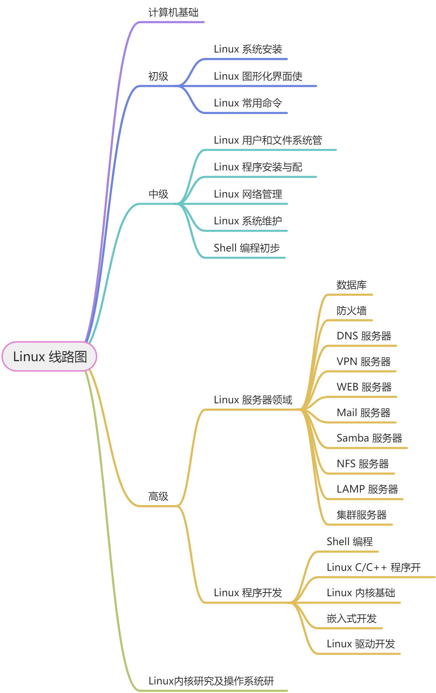

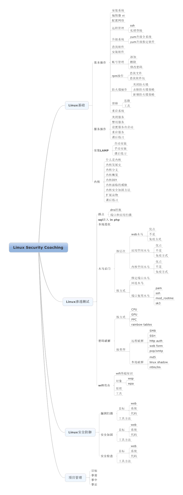

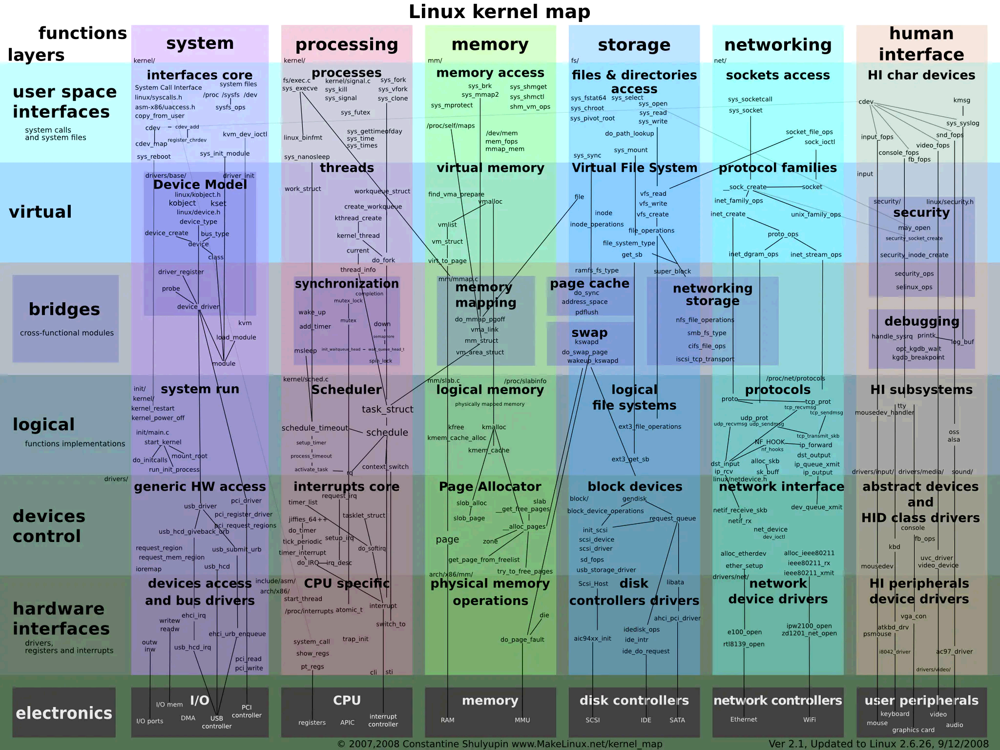

## Linux 内核

**系统结构**

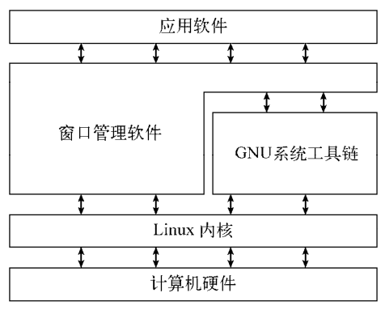

## linux 目录介绍

| 目录名称   | 描述                             |
|--------|--------------------------------|
| /      | 虚拟目录的根目录。通常不会在这里存储文件           |
| /bin   | 二进制目录，存放许多用户级的GNU工具            |
| /boot  | 启动目录，存放启动文件                    |
| /dev   | 设备目录，Linux在这里创建设备节点            |
| /etc   | 系统配置文件目录                       |
| /home  | 主目录，Linux在这里创建用户目录             |
| /lib   | 库目录，存放系统和应用程序的库文件              |
| /media | 媒体目录，可移动媒体设备的常用挂载点             |
| /mnt   | 挂载目录，另一个可移动媒体设备的常用挂载点          |
| /opt   | 可选目录，常用于存放第三方软件包和数据文件          |
| /proc  | 进程目录，存放现有硬件及当前进程的相关信息          |
| /root  | root用户的主目录                     |
| /sbin  | 系统二进制目录，存放许多GNU管理员级工具          |
| /run   | 运行目录，存放系统运作时的运行时数据             |
| /srv   | 服务目录，存放本地服务的相关文件               |
| /sys   | 系统目录，存放系统硬件信息的相关文件             |
| /tmp   | 临时目录，可以在该目录中创建和删除临时工作文件        |
| /usr   | 用户二进制目录，大量用户级的GNU工具和数据文件都存储在这里 |
| /var   | 可变目录，用以存放经常变化的文件，比如日志文件        |

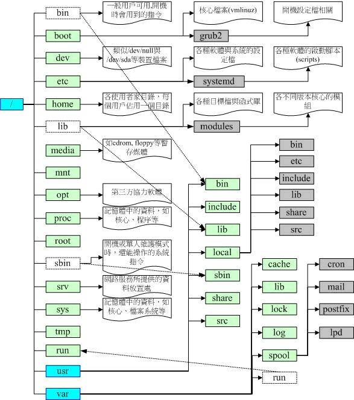


- **可分享的：** 可以分享给其他系统挂载使用的目录，所以包括执行文件与用户的邮件等数据， 是能够分享给
  网络上其他主机挂载用的目录；

- **不可分享的：** 自己机器上面运作的装置文件或者是与程序有关的 socket 文件等， 由于仅与自身机器有关，
  所以当然就不适合分享给其他主机了。

- **不变的：** 有些数据是不会经常变动的，跟随着 distribution 而不变动。 例如函式库、文件说明文件、系统管
  理员所管理的主机服务配置文件等等；

- **可变动的：** 经常改变的数据，例如登录文件、一般用户可自行收受的新闻组等

Filesystem Hierarchy Standard (FHS)标准：已安装软件通常放置于哪个目录

- / (root, 根目录)：与开机系统有关；
- /usr (unix software resource)：与软件安装/执行有关；
- /var (variable)：与系统运作过程有关。

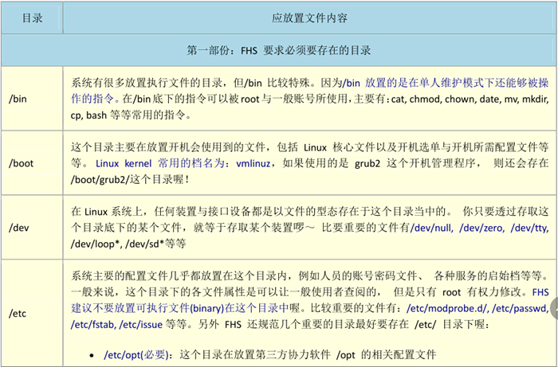

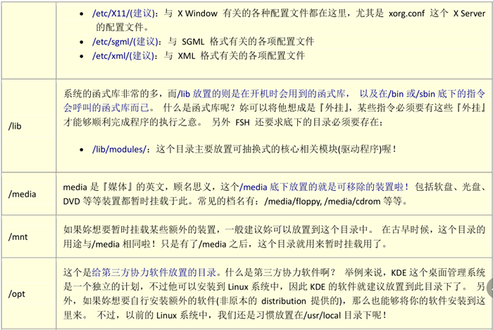

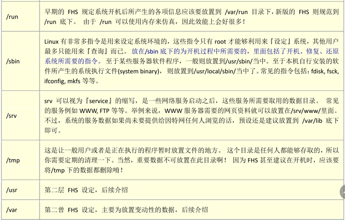


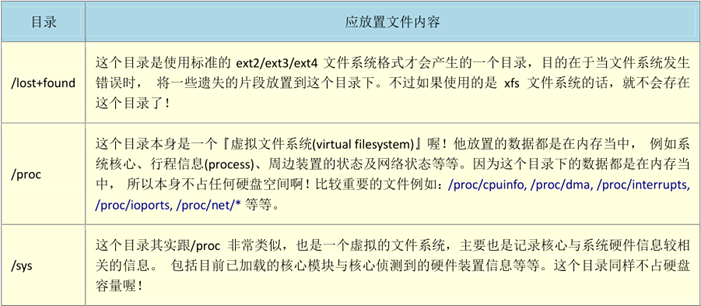

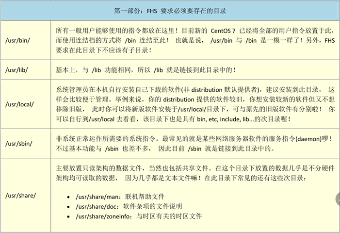

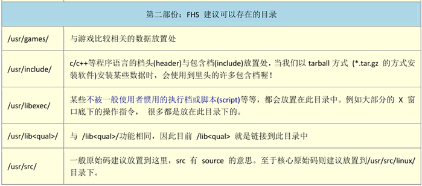


## Linux 文件系统

| 文件系统     | 描 述                         |
|----------|-----------------------------|
| ext      | Linux扩展文件系统，最早的Linux文件系统    |
| ext2     | 第二扩展文件系统，在ext的基础上提供了更多的功能   |
| ext3     | 第三扩展文件系统，支持日志功能             |
| ext4     | 第四扩展文件系统，支持高级日志功能           |
| hpfs     | OS/2高性能文件系统                 |
| jfs      | IBM日志文件系统                   |
| iso9660  | ISO 9660文件系统（CD-ROM）        |
| minix    | MINIX文件系统                   |
| msdos    | 微软的FAT16                    |
| ncp      | Netware文件系统                 |
| nfs      | 网络文件系统                      |
| ntfs     | 支持Microsoft NT文件系统          |
| proc     | 访问系统信息                      |
| ReiserFS | 高级Linux文件系统，能提供更好的性能和硬盘恢复功能 |
| smb      | 支持网络访问的Samba SMB文件系统        |
| sysv     | 较早期的Unix文件系统                |
| ufs      | BSD文件系统                     |
| umsdos   | 建立在msdos上的类Unix文件系统         |
| vfat     | Windows 95文件系统（FAT32）       |
| XFS      | 高性能64位日志文件系统                |

Linux内核采用虚拟文件系统（Virtual File System，VFS）作为和每个文件系统交互的接口。这为Linux内核同任何类型文件系统通信提供了一个标准接口。当每个文件系统都被挂载和使时，VFS将信息都缓存在内存中。

## Linux发行版

**核心Linux发行版**

| 发行版       | 描 述                           |
|-----------|-------------------------------|
| Slackware | 最早的Linux发行版中的一员，在Linux极客中比较流行 |
| Red Hat   | 主要用于Internet服务器的商业发行版         |
| Fedora    | 从Red Hat分离出的家用发行版             |
| Gentoo    | 为高级Linux用户设计的发行版，仅包含Linux源代码  |
| openSUSE  | 用于商用和家用的发行版                   |
| Debian    | 在Linux专家和商用Linux产品中流行的发行版     |

**特定用途的Linux发行版**

| 发行版         | 描述                             |
|-------------|--------------------------------|
| CentOS      | 一款基于Red Hat企业版Linux源代码构建的免费发行版 |
| Ubuntu      | 一款用于学校和家庭的免费发行版                |
| PCLinuxOS   | 一款用于家庭和办公的免费发行版                |
| Mint        | 一款用于家庭娱乐的免费发行版                 |
| dyne:bolic  | 一款用于音频和MIDI应用的免费发行版            |
| Puppy Linux | 一款适用于老旧PC的小型免费发行版              |

**Linux LiveCD发行版**

| 发行版         | 描述                                |
|-------------|-----------------------------------|
| Knoppix     | 来自德国的一款Linux发行版，也是最早的LiveCD Linux |
| PCLinuxOS   | 一款成熟的LiveCD形式的Linux发行版            |
| Ubuntu      | 为多种语言设计的世界级Linux项目                |
| Slax        | 基于Slackware Linux的一款LiveCD Linux  |
| Puppy Linux | 为老旧PC设计的一款全功能Linux                |

## 目录文件管理

@include(./commands/cd.md{6-})

@include(./commands/ls.md{6-})

@include(./commands/ln.md{6-})

@include(./commands/mkdir.md{6-})

@include(./commands/pwd.md{6-})

@include(./commands/cp.md{6-})

@include(./commands/mv.md{6-})

@include(./commands/rmdir.md{6-})

@include(./commands/rm.md{6-})

@include(./commands/touch.md{6-})

@include(./commands/echo.md{6-})

@include(./commands/tee.md{6-})

@include(./commands/cat.md{6-})

@include(./commands/more.md{6-})

@include(./commands/less.md{6-})

@include(./commands/find.md{6-})

@include(./commands/head.md{6-})

@include(./commands/tail.md{6-})

@include(./commands/file.md{6-})

@include(./commands/which.md{6-})

@include(./commands/whereis.md{6-})

@include(./commands/read.md{6-})

@include(./commands/awk.md{6-})

@include(./commands/sort.md{6-})

## 符号含义

| 符号        | 含义                               |
| ----------- | ---------------------------------- |
| `l`         | 管道符或者正则                     |
| `>`         | 输出重定向                         |
| `>>`        | 输出追加重定向                     |
| `<`         | 输入重定向                         |
| `<<`        | 输入追加重定向                     |
| `~`         | 当前用户家的目录                   |
| `$()`  \`\` | 引用命令被执行后的结果             |
| `$`         | 以 xx结尾的（正则表达式）          |
| `^`         | 以 xx开头的（正则表达式）          |
| `*`         | 匹配全部字符，通配符               |
| `?`         | 任意一个字符，通配符               |
| `#`         | 注释                               |
| `&`         | 让脚本或程序在后台执行             |
| `&&`        | 并且，条件同时成立                 |
| `[]`        | 表示一个范围（正则表达式，通配符） |
| `{}`        | 产生一个系列（通配符）             |
| `.`         | 当前目录的硬链接                   |
| `..`        | 上级目录的硬链接                   |
|             |                                    |

## 编辑器

@include(./commands/vim.md{6-})

@include(./commands/nano.md{6-})

@include(./commands/emacs.md{6-})

@include(./commands/kde.md{6-})

@include(./commands/gnome.md{6-})

## 用户及权限管理

@include(./commands/chown.md{6-})

@include(./commands/chmod.md{6-})

@include(./commands/usermod.md{6-})

@include(./commands/umask.md{6-})

@include(./commands/chgrp.md{6-})

---

## 文件传输

---

## sed

```shell
# 设置IP
  sed -ri "/IPADDR/s#(.*.)\..*#\1.${ip}\"#" /etc/sysconfig/network-scripts/ifcfg-ens33
# 设置UUID
  sed -ri "s/UUID=.*/UUID=\"${UUID}\"/" /etc/sysconfig/network-scripts/ifcfg-ens33
  #$(sed -n '3,100p) 读取文件的3-100行
  cat /etc/hosts\n$(sed -n '3,100p' /etc/hosts)
```

## gawk

## 正则表达式

## 系统管理

```
adduser  chfn  useradd  date
exit  finger  fwhios  sleep
suspend  groupdel    halt
kill  last  lastb  login
logname  logout  ps  nice
procinfo  top  pstree  reboot
rlogin  rsh  sliplogin  screen
shutdown  rwho  sudo  gitps
swatch  tload  logrotate  uname
chsh  userconf  userdel  usermod
vlock  who  whoami  whois
newgrp  renice  su  skill
w  id  groupadd  free 
```

@include(./commands/ps.md{6-})

@include(./commands/top.md{6-})

@include(./commands/kill.md{6-})

### 防火墙

实际应用场景中防火墙是要打开的，只能开放端口来外部访问。一般是通过开放端口来实现，关闭防火墙容易导致安全问题。

**启动命令**：systemctl start firewalld；systemctl restart firewalld；systemctl status firewalld

**自动启动**：systemctl disable firewalld | systemctl enablefirewalld

**开放端口**：firewall-cmd --zone=public --add-port=3306/tcp --permanent

> --zone #作用域
>
> --add-port=3306/tcp #添加端口，格式为：端口/通讯协议
>
> --permanent #永久生效，没有此参数重启后失效
>

**查看开启端口**：netstat -ntlp 或：firewall-cmd --list-ports

### deepin 防火墙

**获取更新**：sudo apt-get update

**更新系统**：sudo apt-get dist-upgrade -y

**清理更新缓存**：sudo apt-get autoclean

sudo apt-get install ufw || sudo apt install gufw

sudo ufw status：active启动，inactive未启动

sudo ufw enable

sudo ufw disable

### 端口

查看：netstat -tunlp |grep port

netstat -ntlp 或：firewall-cmd --list-ports

### 修改文件监视程序数量的系统限制

sudo echo fs.inotify.max_user_watches=524288 | sudo tee -a /etc/sysctl.conf

## 系统设置

reset

clear

alias

dircolors

aumix

bind

chroot

clock

crontab

declare

depmod

dmesg

enable

eval

export

pwunconv

grpconv

rpm

insmod

kbdconfig

lilo

liloconfig

lsmod

minfo

set

modprobe

ntsysv

mouseconfig

passwd

pwconv

rdate

resize

rmmod

grpunconv

modinfo

time

setup

sndconfig

setenv

setconsole

timeconfig

ulimit

unset

chkconfig

apmd

hwclock

mkkickstart

fbset

unalias

SVGATextMode

gpasswd

## 安装软件程序

包管理基础

使用Debian包

使用Red Hat包

从源码安装

## 备份压缩

| 命令      | 文件格式 | 描述                               |
|---------|------|----------------------------------|
| bzip2   | .bz2 | 采用Burrows-Wheeler块排序文本压缩算法和霍夫曼编码 |
 | gzip    | .gz  | 用来压缩文件；输出`.gz`                   |
| gunzip  |      | 用来解压文件                           |
| gzcat   | .gz  | 用来查看压缩过的文本文件的内容                  |
| zip     | .zip | Windows上PKZIP工具的Unix实现           |
| zipinfo |      |                                  |
| gzexe   |      |                                  |
| tar     | .tar |                                  |

@include(./commands/tar.md{6-})

## 磁盘管理

dirs

edquota

eject

mcd

mdeltree

mdu

mlabel

mmd

mrd

mzip

quota

rmt

stat

tree

umount

quotacheck

quotaoff

lndir

repquota

quotaon

- **df**（英文全称：disk free）：列出文件系统的整体磁盘使用量
- **du**（英文全称：disk used）：检查磁盘空间使用量
- **fdisk**：用于磁盘分区

@include(./commands/df.md{6-})

@include(./commands/du.md{6-})

@include(./commands/fdisk.md{6-})

@include(./commands/mkfs.md{6-})

@include(./commands/fsck.md{6-})

@include(./commands/mount.md{6-})

## 磁盘维护

badblocks

cfdisk

dd

e2fsck

ext2ed

fsck

fsck.minix

fsconf

fdformat

hdparm

mformat

mkbootdisk

mkdosfs

mke2fs

mkfs.ext2

mkfs.msdos

mkinitrd

mkisofs

mkswap

mpartition

swapon

symlinks

sync

mbadblocks

mkfs.minix

fsck.ext2

fdisk  

losetup

mkfs  

sfdisk  

swapoff

## 网络通讯

apachectl

arpwatch

dip

getty

mingetty

uux

telnet

uulog

uustat

ppp-off

netconfig

nc

httpd

ifconfig

minicom

mesg

dnsconf

wall

netstat

ping

pppstats

samba

setserial

talk

traceroute

tty

newaliases

uuname

netconf

write

statserial

efax

pppsetup

tcpdump

ytalk

cu

smbd

testparm

smbclient

shapecfg

## 设备管理

setleds

loadkey

rdev

dumpkeys

MAKEDEV

poweroff

## 电子邮件与新闻组

## 其他命令

bc

tail

head

xargs

ip

nohub

killall

kill

pkill

## 启动 java 服务

nohub java -jar xxx.jar

sh start.sh start

## 实用的工具

[https://www.zhihu.com/question/59227720/answer/163594782](https://www.zhihu.com/question/59227720/answer/163594782)
