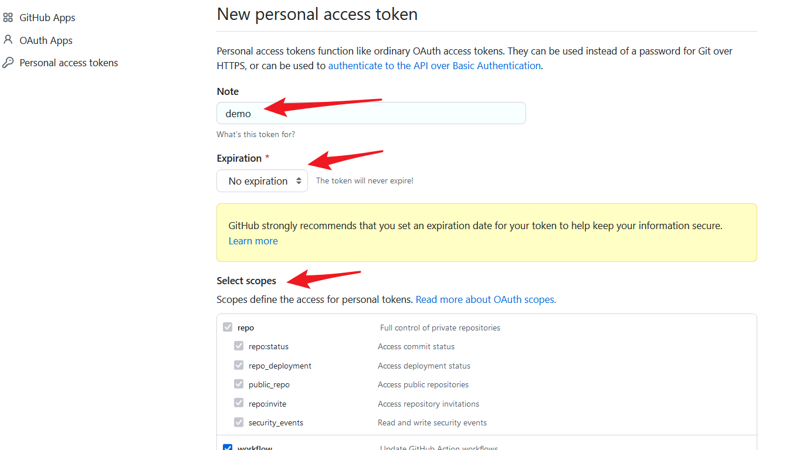
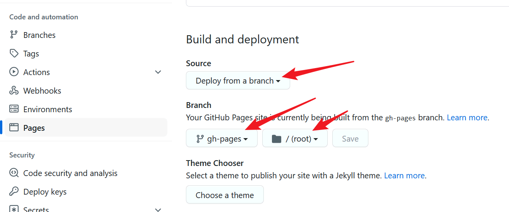

<!-- more -->

# Github 自动部署WEB项目

## 创建仓库

...... 忽略 ......

## 配置 TOKEN

[创建token地址](https://github.com/settings/tokens)，记得保存好token，等一下需要用到


**配置好权限**




**在项目仓库里配置：**
快捷地址，在仓库地址后面加上： `/settings/secrets/actions`

nane为 ACCESS_TOKEN，值为刚才的 token


## 创建 vuepress-theme-hope 项目

命令行执行：npm create vuepress-theme-hope@next docs

```shell
mkdir demo
cd demo
npm create vuepress-theme-hope@next docs
? Select a language to display / 选择显示语言 简体中文
? 选择包管理器 npm
获取依赖的最新版本...
生成 package.json...
? 设置应用名称 demo
? 设置应用版本号 2.0.0
? 设置应用描述 自动部署测试
? 设置协议 MIT
? 项目需要用到多语言么? No
? 是否需要一个自动部署文档到 GitHub Pages 的工作流？ Yes
生成模板...
? 选择你想使用的源 国内镜像源
安装依赖...
这可能需要数分钟，请耐心等待.
我们无法正确输出子进程的进度条，所以进程可能会看似未响应

added 595 packages in 22s
模板已成功生成!
? 是否想要现在启动 Demo 查看? No
提示: 请使用 "npm run docs:dev" 命令启动开发服务器
```

## 编辑 `.github/workflows/deploy-docs.yml`


- [https://github.com/peaceiris/actions-gh-pages](https://github.com/peaceiris/actions-gh-pages)

- [https://github.com/JamesIves/github-pages-deploy-action](https://github.com/JamesIves/github-pages-deploy-action)


`main`分支为触发`CI/CD`，完整项目分支代码

`gh-pages（可自定义）`分支为`GITHUB`自动打包后需要存放的分支


-------------

- `JamesIves/github-pages-deploy-action` 作者的

- - 示例1：npm模式（[docs-v1.yml](https://github.com/topsjf/topsjf/blob/main/.github/workflows/docs-v1.yml.old)）

```yaml
name: 部署文档（v1）

on:
  push:
    branches:
      - main
jobs:
  deploy-gh-pages:
    name: 将文档部署到 v1
    runs-on: ubuntu-latest
    steps:
      - name: Checkout
        uses: actions/checkout@v3
        with:
          fetch-depth: 0

      - name: 设置 Node.js
        uses: actions/setup-node@v3
        with:
          node-version: 16
          cache: npm

      - name: 安装 npm
        run: npm install

      - name: build 构建文档
        env:
          NODE_OPTIONS: --max_old_space_size=4096
        run: npm run docs:build

      - name: deploy 部署
        uses: JamesIves/github-pages-deploy-action@v4
        with:
          branch: v1
          folder: dist
          token: ${{ secrets.ACCESS_TOKEN }}
          single-commit: true

```

- - 示例2：pnpm模式（[docs.yml](https://github.com/topsjf/topsjf/blob/main/.github/workflows/docs.yml)）

```yaml
name: 部署文档

on:
  push:
    #tags:
    branches:
      - main
    paths-ignore:
      - img/**
      - README.md
      - LICENSE

jobs:
  deploy-gh-pages:
    runs-on: ubuntu-latest
    steps:
      - name: Checkout
        uses: actions/checkout@v3
        with:
          fetch-depth: 0
          # 如果你文档需要 Git 子模块，取消注释下一行
          # submodules: true

      - name: 安装 pnpm
        uses: pnpm/action-setup@v2
        with:
          version: 7
          run_install: true

      - name: 设置 Node.js
        uses: actions/setup-node@v3
        with:
          node-version: 16
          cache: pnpm

      - name: 安装 Deps
        run: pnpm install --frozen-lockfile

      - name: 构建文档
        env:
          # BASE: /v2/
          # HOSTNAME: https://topsjf.github.io/
          NODE_OPTIONS: --max_old_space_size=8192
        run: |-
          pnpm run build:vite
          > docs/.vuepress/dist/.nojekyll

      - name: 部署文档
        uses: JamesIves/github-pages-deploy-action@v4
        with:
          # repository-name: topsjf/v2
          # 这是文档部署到的分支名称
          branch: page-dev
          folder: docs/.vuepress/dist
          token: ${{ secrets.ACCESS_TOKEN }}
          single-commit: true


```
安装 pnpm 步骤可以替换为：
```yaml
      - name: 安装 pnpm
        run: corepack enable && corepack prepare pnpm@7.15.0 --activate
```

-------------

- `peaceiris/actions-gh-pages` 作者的

```yaml
name: 部署文档

on:
  push:
    branches:
      - main
  pull_request:

jobs:
  deploy:
    runs-on: ubuntu-22.04
    permissions:
      contents: write
    concurrency:
      group: ${{ github.workflow }}-${{ github.ref }}
    steps:
      - uses: actions/checkout@v3

      - name: Setup Node
        uses: actions/setup-node@v3
        with:
          node-version: '16'

      - name: Cache dependencies
        uses: actions/cache@v2
        with:
          path: ~/.npm
          key: ${{ runner.os }}-node-${{ hashFiles('**/package-lock.json') }}
          restore-keys: |
            ${{ runner.os }}-node-

      - run: npm ci
      - run: npm test
      - run: npm run generate

      - name: deploy 部署
        uses: peaceiris/actions-gh-pages@v3
        if: ${{ github.ref == 'refs/heads/main' }}
        with:
          github_token: ${{ secrets.ACCESS_TOKEN }}
          publish_dir: ./dist
```

------------

## 保留需要的文件，没有就创建


**npm模式使用 package-lock.json**

**pnpm模式使用 pnpm-lock.yaml，也可以不用这个文件，上面的示例2中（ `pnpm/action-setup@v2` ）会自动生成该文件**

[docs.npmjs.com/cli/v7/configuring-npm/npm-shrinkwrap-json](https://docs.npmjs.com/cli/v7/configuring-npm/npm-shrinkwrap-json)

`npm-shrinkwrap.json` 级别大于 `package-lock.json` 大于 `yarn.lock`


## 配置Pages

/settings/pages




## 提交项目后，查看触发效果


查看具体执行过程


## 根据page配置，自动部署代码


## 访问

https://自己的仓库.github.io/

