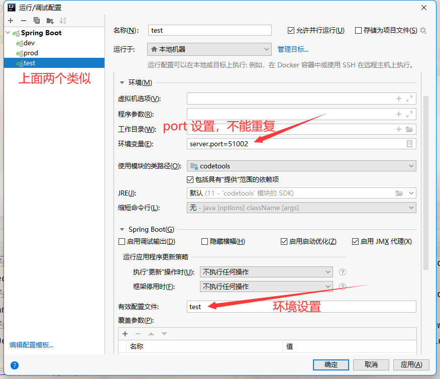

<!-- more -->

## 常用的插件：

Alibaba Java、CamelCase、Chinese、codeGlance3、codota、GenerateAllSetter、gitee、Grep Console、mybatis-log、RestfulToolkit、Translation、vuejs、GsonFormatPlus、json parser


## 常用快捷键

```markdown
Ctrl+空格: 代码提示
Ctrl+Alt+Space: 类名或接口名提示
Ctrl+P: 使用方法参数提示
Ctrl+Q: 显示注释文档
Ctrl+F12: 显示当前类中的成员变量和方法
Ctrl+H: 显示类结构图
Alt+1: 快速打开或隐藏工程面板
Ctrl+Alt+ left/right: 返回至上次浏览的位置
Alt+ left/right: 切换代码视图
F2 或Shift+F2: 高亮错误或警告快速定位
双击Shift: 查找项目中所有目录中的文件

Ctr+F: 在当前文件中查找指定内容
Ctrl+Shift+F: 在当前项目查找包含查找内容的文件
Ctrl+N: 查找类
Ctrl+Shift+N: 查找类和文件
Ctrl+E: 显示最近使用过的文件
Alt+F7: 查找函数或者变量或者类的所有引用到的地方
Ctrl+Shift+Alt+N: 查找类中的方法或变量
Ctrl+D: 复制当前行到下一行
Ctrl+X: 剪切当前行
Ctrl+C/Ctrl+V: 复制/粘贴
Ctrl+Z: 撤销

Ctrl+Shift+Z: 取消撤销
Shift+Enter: 另起一行
Ctrl+R: 当前文件替内容
Ctrl+Shift+R: 当前项目文件替换
Shift+F6: 重命名项目、类、方法、变量
Ctrl+K: 代码提交到SVN
Ctrl+T: 更新代码
Alt+Insert: 在类上自动生成构造器、getter/setter等等常用方法，在项目上创建新的类和文件
Ctrl+Alt+O: 优化导入的类和包
Ctrl+Shift+Space: 自动补全代码
Alt+Shift+C: 对比最近修改的代码

Ctrl+Shift+上键/下键: 代码向上/下移动
Ctrl+/ 或 Ctrl+Shift+/:注释
Ctrl+Alt+left/right: 返回至上次浏览的位置
Alt+Up/Down: 在方法间快速移动定位
Ctrl+W: 选中代码，连续按会有其他效果Alt+F3 ，逐个往下查找相同文本，并高亮显示
Ctrl+Up/Down: 光标跳转到第一行或最后一行下Ctrl+B 快速打开光标处的类或方法
Alt+Enter: 导入包,修正代码,实现接口方法,简化代码等等
Ctrl+Alt+L: 自动格式化代码
CTRL+ALT+I:  自动缩进 
CTRL+ALT+O:  优化导入的类和包 
ALT+INSERT:  生成代码(如GET,SET方法,构造函数等) 

CTRL+E: 最近更改的代码 
CTRL+SHIFT+SPACE: 自动补全代码 
CTRL+空格:  代码提示 
CTRL+ALT+SPACE:  类名或接口名提示 
CTRL+P:   方法参数提示 
CTRL+J:   自动代码 
CTRL+ALT+T:  把选中的代码放在 TRY{} IF{} ELSE{} 里
Ctrl+Shift+U： 大小写的快速切换

```

## idea设置 java类文件注释模板

```java
/**
  * 
  * @author jf
  * @jdk-version: 17
  * @date: ${DATE} ${TIME}
  * /
```


## 同一个启动类：多环境+多port 运行





